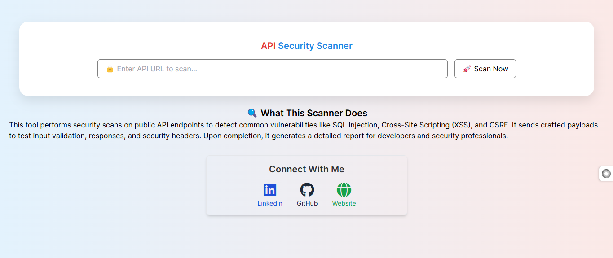
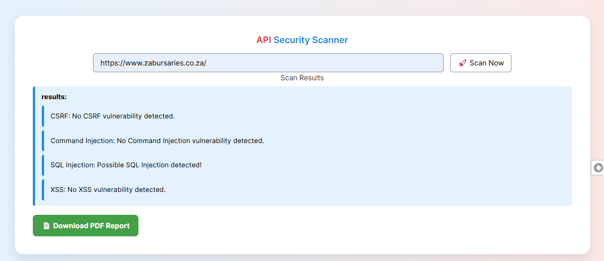

# 🛡️ API Security Scanner

This is an automated API Security Testing Tool built with **Python** and **Flask**, designed to scan APIs for common security vulnerabilities like **SQL Injection**, **XSS (Cross-Site Scripting)**, and **CSRF (Cross-Site Request Forgery)**.

## 🖼️ Demo

### 🖼️ Demo

  
*Home interface of the API Security Scanner*

  
*Example of a SQL Injection test result*

## 📦 Features

- 🔍 SQL Injection Scanner
- ⚠️ XSS Detection
- 🛡️ CSRF Check (planned)
- 🧪 Built-in testing interface
- 🔐 Designed for ethical hacking and fintech/cybersecurity testing

---

## 🛠️ Installation

1. **Clone the repository**:

git clone https://github.com/Vusi-Kunene-Matlou/API-SECURITY-SCANNER.git
cd API-SECURITY-SCANNER

2.Create a virtual environment:
python -m venv venv
source venv/bin/activate  # On Windows: venv\Scripts\activate

3.Install dependencies:
pip install -r requirements.txt

🧠 About the Developer
👨‍💻 Developed by Vusi Kunene Matlou, a cybersecurity enthusiast passionate about fintech security, ethical hacking, and blockchain.
⚠️ Disclaimer
This tool is built for educational and ethical purposes only. Do not use it without permission on any live API.
